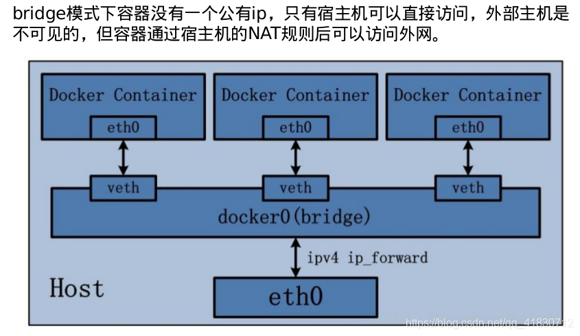
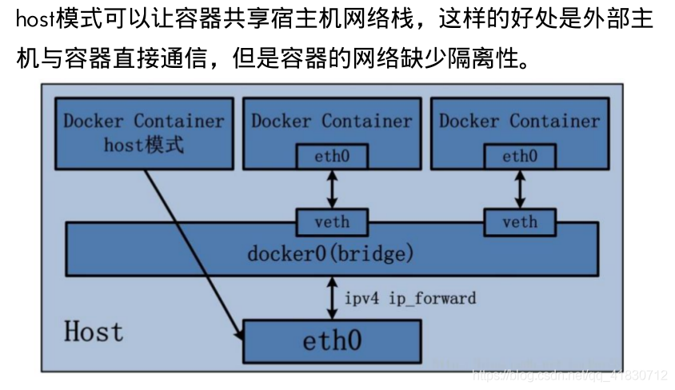
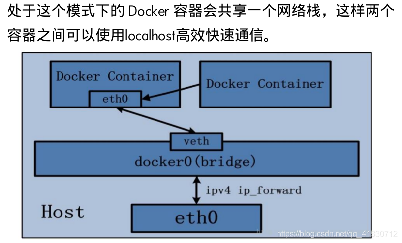

# Docker网络模式

## 目录
* [bridge模式](#bridge模式)
* [host模式](#host模式)
* [none模式](#none模式)  
* [container网络模式](#container网络模式)
* [上传镜像至DockerHub](#上传镜像至DockerHub)

---

安装Docker后，会默认创建三种网络，可通过docker network ls 查看
```
jerry@ubuntu:~$ sudo docker network ls
NETWORK ID     NAME      DRIVER    SCOPE
e594e15c56d1   bridge    bridge    local
acd2edc5fc4a   host      host      local
a63061366529   none      null      local
```

网络模式 | 文件名	
-----| ---
bridge |为每个容器分配设置IP等，并将容器连接到一个 docker0 虚拟网桥，默认为该模式
host   |  容器将不会虚拟出自己的网卡，而是使用宿主机的IP和端口
none   | 容器有独立的 Network namespace，但并没有进行任何网络设置，如分配veth pair和网桥链接，IP等
container |新创建的容器不会创建自己的网卡和配置自己的IP，而是和一个指定的容器共享IP,端口范围。

>bridge为默认不需要用–net去指定，其他三种模式需要在创建容器时使用–net去指定。


## bridge模式

创建容器时通过参数 `--net bridge` 或 `--network bridge` 指定。是创建容器时的默认模式，该参数可以省略。

在该 bridge 模式下，Docker Daemon 会创建出一个名为 docker0 的虚拟网桥 ，用来连接宿主机与容器，或者连接不同的容器。  
Docker 利用 veth pair 技术，在宿主机上创建了两个虚拟网络接口 veth0 和 veth1（veth pair 技术的特性可以保证无论哪一个 veth 接收到网络报文，都会无条件地传输给另一方）。  




## host模式

创建容器时通过参数 `--net host` 或 `--network host`指定。

采用host模式的容器 直接使用宿主机的ip地址与外界通信，端口也使用宿主机的端口，无需进行NAT转换.  




## none模式

创建容器时通过参数 `--net none` 或 `--network none`指定。

none模式是指禁用网络模式，只有lo接口，代表 127.0.0.1，即 localhost本地环路接口。

```
//查看所有none模式的容器
#docker  network inspect none
```

## container网络模式

container网络模式是Docker中易中特别的网络模式。在创建容器时通过参数 --net container:已运行的容器名称|ID 或 --network container:已运行的容器名称|ID指定。



该模式下的Docker容器会共享一个网络栈，这样两个容器之间可以使用localhost高效快速通信。虽然多个容器共享网络环境,但是多个容器形成的整体依然与宿主机以及其他容器形成网络隔离。

>Container网络模式的缺陷：  
>它并没有改善容器与宿主机以外世界通信的情况（和桥接模式一样，不能连接宿主机以外的其他设备）。


2. 自定义网络模式
自定义网络模式,docker提供了三种自定义网络驱动:
bridge
overlay
macvlan
bridge驱动类似默认的bridge网络模式,但增加了一些新的功能,overlay和macvlan是用于创建跨主机网络。
建议使用自定义的网络来控制哪些容器可以相互通信,还可以自动DNS解析容器名称到IP地址。

从Docker1.10版本开始，docker daemon实现了一个内嵌的DNS Server，使容器可以直接通过容器名进行通信。
方法很简单，只要在创建容器时使用 --name 为容器命名即可。 但使用Docker DNS有个限制，只能在 user-defined 网络中使用。默认的bridge网络时无法使用DNS的。


创建网络

1.使用自动分配的ip地址和网关地址
通过 docker network create 命令创建自定义网络模式。

# docker network create  my_net1     // -d bridge 默认值

# docker network ls
# ip addr
查看bridge自定义网络（自动分配的ip地址和网关地址）的网关地址

docker network inspect my_net1 
查看bridge自定义网络（自动分配的ip地址和网关地址）的信息

使用自定义网络模式创建容器
#docker run -it  --name bbox6 --network=my_net1 busybox

#docker run -it  --name bbox7 --network=my_net1 busybox
    # ping bbox6 

在自定义网桥上（自定义的ip地址和网关地址），同一网桥上的容器是可以通信的。

2、使用–ip参数可以指定容器ip地址，
但必须是在自定义网桥上（自定义的ip地址和网关地址），默认的bridge模式不支持，同一网桥上的容器是可以通信的
值的注意的是：

docker的bridge自定义网络之间默认是有域名解析的；
docker的bridge自定义网络与系统自带的网桥之间默认是有解析的；
但是docker的系统自带的网桥之间默认是没有解析的。

docker network create --subnet=172.21.0.0/24 --gateway=172.21.0.1 my_net2

使用自定义网桥创建容器,，自定义ip地址：
docker run -it --name bbox7--network=my_net2 --ip=172.21.0.7 busybox
docker run -it --name bbox8--network=my_net2 --ip=172.21.0.8 busybox

默认使用不同网桥的容器是不可以通讯的。

连接网络
通过 docker network connect 网络名称 容器名称 为容器连接新的网络模式

断开网络
通过 docker network disconnect 网络名称 容器名称 命令断开网络


移除网络
通过 docker network rm 网络名称 命令移除自定义网络模式。移除成功后会返回网络模式名称。
主要： 如果通过某个自定义网络模式创建了容器，则该网络模式无法删除。


三、使两个不同网桥的容器通信
我们现在的vm1使用的是my_net1网桥，vm3使用的是my_net2网桥，默认是不能通讯的。

使用 docker network connect命令为vm1添加一块my_net2 的网卡

[root@server1 ~]# docker network connect my_net2 vm1
[root@server1 ~]# docker attach vm1

可以成功通讯！！！

值的注意的是：

docker的bridge自定义网络之间：双方可以随便添加对方的网卡
docker的bridge自定义网络与系统自带的网桥之间：只能是，系统自带的网桥对应的容器添加bridge自定义网络对应的容器的网卡。而反过来会报错。
但是docker的系统自带的网桥之间：是可以通信的，因为是在一个网络桥接上。


