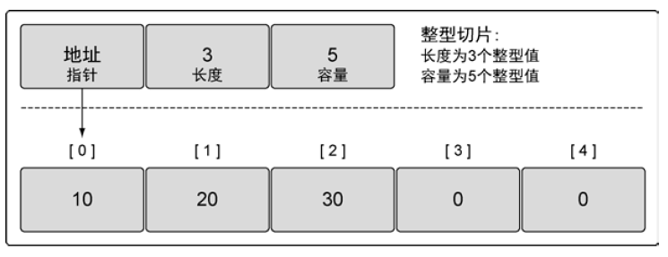
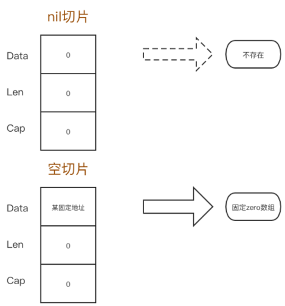
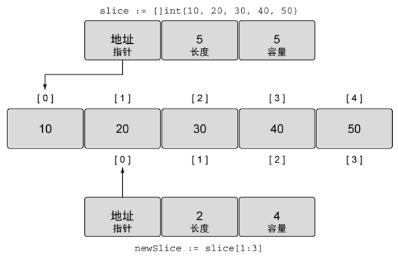
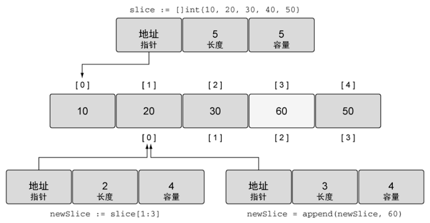
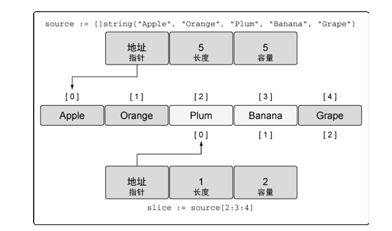

# 目录

* [包](#包)
  * [main包](#main包)
  * [包的导入](#包的导入)
  * [函数init](#函数init)
* [数组、切片和映射](#数组、切片和映射)
  * [数组](#数组)
  * [切片](#切片)
  * [映射map](#映射map)


---
# 基础知识

## 标识符

go语言的标识符构成规则：开头一个字符必须是字母或下划线_,后面跟任意多个字符、字母或下划线，并区分大小写。

go语言预声明的标识符包括关键字、内置数据类型标识符，常量值标识符、内置函数和空白标识符。

关键字：25个
```go
package     // 定义包名         struct        // 定义结构类型
import      // 导入包           interface     // 定义接口类型
const       // 常量声明         map           // 声明或创建map类型
var         // 变量声明         chan          // 声明或创建通道类型
func        // 函数定义
defer       // 延迟执行
go          // 并发语法糖
return      // 函数返回

if		else                        // if else 语句
for		range	break	continue    // for循环语句
switch  select  type  case  default  fallthrough  // switch和select语句  
goto     // goto跳转语句	        	 	 
```

内置类型： 20个

```go
整型
	byte    int     int8    int16   int32   int64
	uintprt uint    uint8   unit16  unint32  uint64
浮点
	float32		float64
复数
	complex64	complex128
字符和字符串型
	string		rune
接口型
	error
布尔型
	bool
```


内置函数:  15个

```go
make   new   len   cap   append   copy   delete   panic   recover
close  complex   real   image   Print   Println
```


常量值标识符:  4个

```go
true	false   // bool类型的常量: 真和假
iota            // 用在连续的枚举类型声明中
nil             // 指针/引用型的变量的默认值为nil
```


空标识符:  1个

```go
_
```


## 复合数据类型

基本的复合数据类型有指针、数组、切片、map、通道chan、结构和接口

### 指针

声明:  *T

结构体指针访问结构体字段仍然使用 "."操作符，没有 -> 操作符。


### struct

通常使用自定义struct类型声明格式：

```go
type TypeName struct{
    FieldName FeildType
    FieldName FeildType
    FieldName FeildType
}
```

struct初始化推荐使用字段名的初始化方式:

```go
type Person struct{
	Name string
	Age  int
}
p:=Person{
	Name: "shei",
	Age: 12,
}
```


## 控制结构

### if 语句

- if后面的条件判断不需要小括号括起来， { 必须在行尾与if或if else方法一行。

- if后面可以带一个简单的初始化语句，并以分号分割，其声明的变量作用域在整个if语句块。


```go
if x:=f(); x < y {	//初始化语句中声明变量x
    return x
}else if x > z {	// x作用域在整个if语句块
    return z
}else {
    return y
}
```

### switch语句

- switch后面可以带一个可选的初始化语句

- switch后面的表达式也是可选的

- 通过fallthrough语句强制执行下一个case子句（不再检测条件）

- swicth支持default语句，default语句可以放到任意位置。


```go
switch i:="y"; i {  // 可带初始化语句
    case "y", "Y":
    	fmt.Println("yes")
    	fallthrough		// 直接跳过下一个case条件表达式，执行下一个语句
    case "n", "N":
    fmt.Println("no")
}

score：= 85
grade := ''
switch{
    case score >= 90:
    	grade = 'A'
    case score >= 80:
    	grade = 'B'
    case score >= 60:
    	grade = 'C'
    default:
    	grade = 'F'    
}
```


### for 语句

三种使用场景：

```go
for init; condition; post { }
```

```go
for condition {  }	//类似 while语句
```

```go
for {  }	// 类似 while(1)死循环语句
```

for 还有一种用法，是对数组、切片、宇符串、map 和通道的访问，语法格式如下：

```go
// 访问map
for key, value := range map {  }
for key := range map {  }

// 访问数组
for index, value := range arry {  }
for index := range arry {  }
for _, value := range arry {  }

// 访问切片
for index, value := range slice {  }
for index := range slice {  }
for _, value := range slice {  }

// 访问通道
for value := range channel {  }
```


### 标签和跳转

1. 标签

标签（ Lable ）标识一个语句的位置，用于goto 、break 、continue 语句的跳转，标标签语法: 

```go
Label:  Statement
```

2. goto

goto 语句用于**函数的内部的跳转**，需要配合标签一起使用， 具体的格式如下：

```
goto Lable
```

- goto 语句只能在函数内跳转。
- goto 语句不能跳过内部变量声明语句。
- goto i吾句只能跳到同级作用域或者上层作用域内，不能跳到内部作用域内。

3. break

break 用于函数内跳出for 、sw itch 、select 语句的执行，有两种使用格式：

- 单独使用，用于跳出break 当前所在的for 、switch 、select 语句的执行。
- 和标签一起使用，用于跳出标签所标识的for 、switch 、select 语句的执行，可用于跳出多重循环，但标签和break 必须在同一个函数内。

4. continue

continue 用于跳出for 循环的本次选代，跳到for 循环的下一次选代的post 语句处执行，也有两种使用格式：

-  单独使用，用于跳出continue 当前所在的for 循环的本次迭代。
- 和标签一起使用，用于跳出标签所标识的for 语句的本次选代，但标签和continue 必须在同一个函数内。


---

# 函数


## 基本概念

- 
  函数是一种类型，函数类型变量可以像其他类型变量一样使用，可以作为其他函数的参数或返回值，也可以直接调用执行。
- 函数支持多值返回。也可以没有返回值。
- 支持闭包。
- 函数支持可变参数。也可以没有输入参数。
- 不支持默认值参数。
- 不支持函数重载。
- 不支持函数嵌套，严格地说是不支持命名函数的嵌套定义，但支持嵌套匿名函数。

### 多值返回

```go
func swap (a, b int) (int, int) {
	return b, a
}
```

如果多值返回值有错误类型，则一般将错误类型作为最后一个返回值。

### 实参到形参的传递

Go 函数实参到形参的传递永远是值拷贝。如果实参是一个指针变量，传递给形参的是这个指针变量的副本，
二者指向同一地址， 本质上参数传递仍然是值拷贝。

### 不定参数

不定参数声明使用param ...type 的语法格式。

- 所有的不定参数类型必须是相同的。
- 不定参数必须是函数的最后一个参数。
- 不定参数名在函数体内相当于切片，对切片的操作同样适合对不定参数的操作。

- 切片可以作为参数传递给不定参数，切片名后要加上“..." 。 数纽不可以作为实参传递给不定参数的函数。

```go
func sum(arr ...int) (sum int) {
    for _, v := range arr {   // 此时arr 就相当于切片，可以使用range 访问
		sum += v
    }
	return
}

func main() {
    slice :=  []int {l, 2, 3, 4}
    array :=  [...]int {1, 2, 3, 4}
    
	// 数纽不可以作为实参传递给不定参数的函数
    sum (slice...)
}
```

- 形参为不定参数的函数和形参为切片的函数类型不相同。

```go
func suma (arr ...int) (sum int) { ... }
func sumb (arr []int) (sum int) { ... }
```


## 函数签名和匿名函数

### 函数签名

函数类型也叫函数签名。

```go
func add (a , b int) int { ... }    // 函数定义
fmt.Printf("%T\n", add)				//  func (int, int) int  函数签名
```

两个函数类型相同的条件是：拥有相同的形参列表和返回值列表（列表元素的次序、个数和类型都相同），形参名可以不同。

**可以使用type 定义函数类型，函数类型变量可以作为函数的参数或返回值。**

```go
package main
import "fmt"

func add(a, b int) int {
	return a + b
}

func sub(a, b int) int {
	return a - b
}

type Op func(int, int) int 	// 定义一个函数类型，输入的是两个int类型，返回位是一个int类型

func do(f Op， a， b int) int {  // 定义一个函数，第一个参数是函数类型Op
	return f(a, b)	 // 函数类型变量可以直接用来进行函数调用
}

func main() {
    a := do(add, 1, 2) 	// 函数名add 可以当作相同函数类型形参，不需妥强制类型转换
	fmt.Println(a)		// 3
	s := do(sub, 1, 2)
	fmt.Println(s) 		// - 1
}
```

函数类型和map、slice、chan 一样，实际函数类型变量和函数名都可以当作指针变量，该指针指向函数代码的开始位置。通常说函数类型变量是一种引用类型，**未初始化的函数类型的变量的默认值是nil** 。

### 匿名函数

匿名函数可以看作函数字面量， 所有直接使用函数类型变量的地方都可以由匿名函数代替。医名函数可以直接赋值给函数变量，可以当作实参，也可以作为返回值，还可以直接被调用。

```go
// 匿名函数被直接赋值函数交量
var sum = func(a , b int) int {
	return a + b
}

//匿名函数作为返回值
func wrap(op string) func(int, int) int {
	switch op {
        case "add":
			return func(a, b int) int {
						return a + b
            		}
        default:
			return nil
    }
}

//匿名函数直接被调用
defer func () {
	if err := recover(); err != nil {
		fmt.Println(err)
}()


func doinput(f func(int, int) int, a, b int) int {
	return f(a, b)
}
//匿名函数作为实参
doinput( func(x, y int) int {
			return x + y
			},	 1, 2)
```


## defer

defer 关键字，可以注册多个延迟调用，这些调用以**先进后出( FILO )**的顺序在函数返回前被执行。defer 常用于保
证一些资源最终一定能够得到回收和释放。

- defer 后面必须是函数或方法的调用
- defer 函数的实参在注册时通过值拷贝传递进去。后续语句并不会影响defer中实参的值。
- 主动调用os.Exit( int） 退出进程时， defer 将不再被执行（即使defer 已经提前注册〉。
- defer 语句的位置不当，有可能导致panic ， 一般defer 语句放在错误检查语句之后。
- defer 会推迟资源的释放， defer 尽量不要放到循环语句里面。
- 大函数内部的defer 语句单独拆分成一个小函数是一种很好的实践方式。

```go
func CopyFile (dst , src string ) (w int64 , err error) {
	src, err := os.Open (src )
	if err != nil {
		return
    }
	defer src.Close()

    dst, err := os.Create(dst)
	if err != nil {
		return
    }
	defer dst.Close ()
    
	w, err ＝io.Copy(dst, src)
    
	return
}
```


## 闭包

闭包是由函数及其相关引用环境组合而成的实体，一般通过在匿名函数中引用外部函数的局部变量或包全局变量构成。
				闭包＝函数＋引用环境

闭包最初的目的是减少全局变量，在函数调用的过程中隐式地传递共享变量，有其有用的一面；但是这种隐秘的共享变量的方式带来的坏处是不够直接，不够清晰，除非是非常有价值的地方， 一般不建议使用闭包。


## panic 和recover

这两个内置函数用来处理Go 的运行时错误((runtime errors )。panic 用来主动抛出错误， recover 用来捕获panic 抛出的错误。

panic 和recover 的函数签名如下：

```go
panic( interface{} )
revover() interface{}
```

引发panic 有两种情况， 一种是程序主动调用panic 函数，另一种是程序产生运行时错误，由运行时检测井抛出。

发生panic 后， 程序会从调用panic 的函数位置或发生panic 的地方立即返回，逐层向上执行函数的**defer 语句**，然后逐层打印函数调用堆枝，直到被**recover** 捕获或运行到最外层函数而退出。

panic 的参数是一个**空接口类型interface{}**，所以任意类型的变量都可以传递给panic。

panic 不但可以在函数正常流程中抛出，在defer 逻辑里也可以再次调用panic 或抛出panic。defer 里面的panic 能够被后续执行的defer 捕获。

recover()用来捕获panic，阻止panic 继续向上传递。**recove() 和defer 一起使用**，但是recover()只有在defer 后面的**函数体内被直接调用才能捕获panic** 终止异常，否则返回nil，异常继续向外传递。

```go
// 这个会捕获失败
defer recover ()

// 这个会捕获失败
defer fmt.Println (recover())

// 这个嵌套两层也会捕获失败
defer func() {
	func () {
		println("defer inner")
		recover() // 无效，不是直接调用
	} ( )
} ( )

// 如下场景会捕获成功
defer func() {
	println("defer inner")
	recover()
} ( )

func except () {
	recover ()
}
func test() {
	defer except ()
	panic("test panic ")
}        
```

- 可以有连续多个panic 被抛出，连续多个panic 的场景只能出现在延迟调用里面，否则不会出现多个panic 被抛出的场景。但**只有最后一次panic 能被捕获**。
- 包中init 函数引发的panic 只能在init 函数中捕获，在main 中无法被捕获，原因是init 函数先于main 执行。
- 函数并不能捕获内部新启动的goroutine 所抛出的panic 。

Go 提供了两种处理错误的方式， 一种是借助panic 和recover 的抛出捕获机制，另一种是
使用error 错误类型。


## 错误处理

Go 语言典型的错误处理方式是将error 作为函数最后一个返回值。在调用函数时， 通过检测其返回的error 值是否为nil 来进行错误处理。

Go 语言内置错误接口类型error 。任何类型只要实现Error() string 方法，都可以传递error接口类型变量。

```go
type error interface {
	Error() string
}
```

- 如果一个函数返回error 类型变量，则先用ifi吾句处理error!= nil 的异常场景，正常逻辑放到if 语句块的后面，保持代码平坦。
- defer i吾句应该放到err判断的后面，不然有可能产生panic。
- 在错误逐级向上传递的过程中，错误信息应该不断地丰富和完善，而不是简单地抛出下层调用的错误。这在错误日志分析时非常有用和友好。


**错误分类：**

- 可捕获错误： 发生非期望的己知行为，这里的己知是指错误的类型是预料并定义好的。
- 未捕获错误-异常: 发生非期待的未知行为。这里的未知是指错误的类型不在预先定义的范围内。

Go 是一门类型安全的语言，其运行时不会出现这种编译器和运行时都无法捕获的错误，不存在所谓的异常，出现的“异常”全是错误。

Go 程序需要处理的这些错误可以分为两类：

- 运行时错误(runtime errors)，此类错误语言的运行时能够捕获，并采取措施一一隐式或显式地抛出panic。
- 程序逻辑错误：程序执行结果不符合预期，但不会引发运行时错误。

Go 对于错误提供了两种处理机制：

- 通过函数返回错误类型的值来处理错误。
- 通过panic 打印程序调用枝，终止程序执行来处理错误。

**error 和panic 的使用应该遵循两条规则：**

1. 程序发生的错误导致程序不能容错继续执行，此时程序应该主动调用panic 或由运行时抛出panic。
2. 程序虽然发生错误，但是程序能够容错继续执行，此时应该使用错误返回值的方式处理错误，或者在可能发生运行时错误的非关键分支上使用recover 捕获panic 。


---

# 包

所有 Go 语言的程序都会组织成若干组文件，每组文件被称为一个包。 Go 语言的每个代码文件都属于一个包。

一个包定义一组编译过的代码，包的名字类似命名空间，可以用来间接访问包内声明的标识符。
所有的.go 文件，除了空行和注释，都应该在第一行声明自己所属的包。每个包都在一个单
独的目录里。给包命名的惯例是使用包所在目录的名字。

## main包
``` go
package main
```
在Go 语言里，命名为main 的包具有特殊的含义。Go 语言的编译程序会试图把这种名字的包编译为二进制可执行文件。所有用Go 语言编译的可执行程序都必须有一个名叫main 的包。
当编译器发现某个包的名字为main 时，它一定也会发现名为main()的函数，否则不会创建可执行文件。

在Go 语言里，标识符要么从包里公开，要么不从包里公开。**包里以大写字母开头的标识符是公开的。以小写字母开头的标识符是不公开的，不能被其他包中的代码直接访问。**

## 包的导入
``` go
import "fmt"
import (
    "strings"
    _ "mypackage"
)

```
关键字import 就是导入一段代码，让用户可以访问其中的标识符，如类型、函数、常量和接口。编译器会使用Go 环境变量设置的路径，通过引入的相对路径来查找磁盘上的包。

**Go 编译器不允许声明导入某个包却不使用。** 下划线 _ 让编译器接受这类导入，并且调用对应包内的所有代码文件里定义的init 函数。

- 远程导入:

``` go
import "github.com/spf13/viper"
```

- 重命名导入:

``` go
import (
    myfmt "/utils/fmt"
)
```

## 函数init
每个包可以包含任意多个init 函数，这些函数都会在程序执行开始的时候被调用。所有被编译器发现的init 函数都会安排在main 函数之前执行。init 函数用在设置包、初始化变量或者其他要在程序运行前优先完成的引导工作。


---
# 数组、切片和映射


## 数组

在Go 语言里，数组是一个长度固定的数据类型，用于存储一段具有相同的类型的元素的连续块。数组存储的类型可以是内置类型，如整型或者字符串，也可以是某种结构类型。

### 声明和初始化

```go
代码清单 声明一个数组，并设置为零值

// 声明一个包含5 个元素的整型数组
var array [5]int

// 声明一个包含5 个元素的整型数组, 用具体值初始化每个元素
array := [5]int{10, 20, 30, 40, 50}

// 声明一个有5 个元素的数组，用具体值初始化索引为1 和2 的元素，其余元素保持零值
array := [5]int{1: 10, 2: 20}

// 容量由初始化值的数量决定
array := [...]int{10, 20, 30, 40, 50}
```

**<u>一旦声明，数组里存储的数据类型和数组长度就都不能改变了。</u>**

### 使用数组

```go
代码清单 访问数组元素
// 声明一个包含5 个元素的整型数组,用具体值初始为每个元素
array := [5]int{10, 20, 30, 40, 50}

// 修改索引为2 的元素的值
array[2] = 35
```

```go
代码清单 把同样类型的一个数组赋值给另外一个数组
// 声明第一个包含5 个元素的字符串数组
var array1 [5]string
// 声明第二个包含5 个元素的字符串数组, 用颜色初始化数组
array2 := [5]string{"Red", "Blue", "Green", "Yellow", "Pink"}
// 把array2 的值复制到array1
array1 = array2
```

数组变量的类型包括数组长度和每个元素的类型。**只有这两部分都相同的数组，才是类型相同的数组，才能互相赋值**。

### 多维数组

```go
代码清单  声明二维数组
// 声明一个二维整型数组，两个维度分别存储4 个元素和2 个元素
var array [4][2]int

// 使用数组字面量来声明并初始化一个二维整型数组
array := [4][2]int{{10, 11}, {20, 21}, {30, 31}, {40, 41}}

// 声明并初始化外层数组中索引为1 个和3 的元素
array := [4][2]int{1: {20, 21}, 3: {40, 41}}

// 声明并初始化外层数组和内层数组的单个元素
array := [4][2]int{1: {0: 20}, 3: {1: 41}}

// 使用索引为多维数组赋值
// 将 array1 的索引为1 的维度复制到一个同类型的新数组里
var array1 [2][2]int
var array3 [2]int = array1[1]

// 将外层数组的索引为1、内层数组的索引为0 的整型值复制到新的整型变量里
var value int = array1[1][0]
```

### 在函数间传递数组

**在函数之间传递变量时，总是以值的方式传递的。** 如果这个变量是一个数组，意味着整个数组，不管有多长，都会完整复制，并传递给函数。

将数组的地址传入函数，只需要在栈上分配8 字节的内存给指针就可以。这个操作会更有效地利用内存，性能也更好。不过要意识到，**因为现在传递的是指针，所以如果改变指针指向的值，会改变共享的内存**。


## 切片

切片是一种数据结构，这种数据结构便于使用和管理数据集合。切片是围绕动态数组的概念构建的，可以按需自动增长和缩小。切片的动态增长是通过内置函数append 来实现的。

### 内部实现

切片是一个很小的对象，对底层数组进行了抽象，并提供相关的操作方法。切片有3 个字段的数据结构，这些数据结构包含Go 语言需要操作底层数组的元数据。



### 创建和初始化

```go
代码清单  使用长度声明一个字符串切片
// 创建一个字符串切片, 其长度和容量都是5 个元素
slice := make([]string, 5)

// 使用长度和容量声明整型切片
// 创建一个整型切片. 其长度为3 个元素，容量为5 个元素
slice := make([]int, 3, 5)
```

```go
代码清单  通过切片字面量来声明切片
// 创建字符串切片. 其长度和容量都是5 个元素
slice := []string{"Red", "Blue", "Green", "Yellow", "Pink"}

// 创建一个整型切片. 其长度和容量都是3 个元素
slice := []int{10, 20, 30}
```

当使用切片字面量时，可以设置初始长度和容量。要做的就是在初始化时给出所需的长度和容量作为索引。

```go
// 创建字符串切片. 使用空字符串初始化第100 个元素
slice := []string{99: ""}
```

**声明数组和声明切片的不同:**

```go
// 创建有3 个元素的整型数组
array := [3]int{10, 20, 30}

// 创建长度和容量都是3 的整型切片
slice := []int{10, 20, 30}
```

**nil 和空切片:**

在声明时不做任何初始化，就会创建一个nil 切片。

利用初始化，通过声明一个切片可以创建一个空切片。

```go
// 创建nil 整型切片
var slice []int

// 使用make 创建空的整型切片
slice := make([]int, 0)

// 使用切片字面量创建空的整型切片
slice := []int{}
```



- **nil切片和空切片指向的地址不一样。nil空切片引用数组指针地址为0（无指向任何实际地址）**
- **空切片的引用数组指针地址是有的，且所有的空切片引用的为固定的同一个值**


### 使用切片

- 赋值和切片

  ```go
  代码清单  使用切片字面量来声明切片
  // 创建一个整型切片.其容量和长度都是5 个元素
  slice := []int{10, 20, 30, 40, 50}
  // 改变索引为1 的元素的值
  slice[1] = 25
  
  // 使用切片创建切片
  // 创建一个新切片. 其长度为2 个元素，容量为4 个元素
  newSlice := slice[1:3]
  ```
  



现在两个切片共享同一个底层数组。如果一个切片修改了该底层数组的共享部分，另一个切片也能感知到。


- 切片增长

  ```go
  代码清单 使用append 向切片增加元素
   
  // 使用原有的容量来分配一个新元素。将新元素赋值为60
  newSlice = append(newSlice, 60)
  
  ```




**如果切片的底层数组没有足够的可用容量，append 函数会创建一个新的底层数组，将被引用的现有的值复制到新数组里，再追加新的值。**


- 创建切片时的3 个索引

在创建切片时，还可以使用之前我们没有提及的第三个索引选项。第三个索引可以用来控制新切片的容量。其目的并不是要增加容量，而是要**限制容量**。

```go
代码清单  使用切片字面量声明一个字符串切片
// 创建字符串切片。其长度和容量都是5 个元素
source := []string{"Apple", "Orange", "Plum", "Banana", "Grape"}

// 将第三个元素切片，并限制容量. 其长度为1 个元素，容量为2 个元素
slice := source[2:3:4]
```



**如果试图设置的容量比可用的容量还大，就会得到一个语言运行时错误。**

在创建切片时设置切片的容量和长度一样，就可以强制让新切片的第一个append 操作创建新的底层数组，与原有的底层数组分离。新切片与原有的底层数组分离后，可以安全地进行后续修改，而不用担心会不小心修改了其他切片里的数据。

**内置函数append** 也是一个**可变参数的函数**。这意味着可以在一次调用传递多个追加的值。如果使用**...运算符**，可以将一个切片的所有元素追加到另一个切片里。

```go
// 创建两个切片，并分别用两个整数进行初始化
s1 := []int{1, 2}
s2 := []int{3, 4}

// 将两个切片追加在一起，并显示结果
fmt.Printf("%v\n", append(s1, s2...))
Output:
[1 2 3 4]
```


- 迭代切片

  Go 语言有个特殊的关键字range，它可以配合关键字for 来迭代切片里的元素.

```go
  代码清单  使用for range 迭代切片
  // 创建一个整型切片.其长度和容量都是4 个元素
  slice := []int{10, 20, 30, 40}
  
  // 迭代每一个元素，并显示其值
  for index, value := range slice {
  	fmt.Printf("Index: %d Value: %d\n", index, value)
  }
  Output:
  Index: 0 Value: 10
  Index: 1 Value: 20
  Index: 2 Value: 30
  Index: 3 Value: 40
```

**需要强调的是，range 创建了每个元素的副本，而不是直接返回对该元素的引用。如果使用该值变量的地址作为指向每个元素的指针，就会造成错误。** 因为迭代返回的变量是一个迭代过程中根据切片依次赋值的新变量，所以value 的地址总是相同的。要想获取每个元素的地址，可以使用切片变量和索引值。

```go
代码清单 使用传统的for 循环对切片进行迭代
// 创建一个整型切片. 其长度和容量都是4 个元素
slice := []int{10, 20, 30, 40}

// 从第三个元素开始迭代每个元素
for index := 2; index < len(slice); index++ {
	fmt.Printf("Index: %d Value: %d\n", index, slice[index])
}
Output:
Index: 2 Value: 30
Index: 3 Value: 40
```

有两个特殊的**内置函数len 和cap**，可以用于处理数组、切片和通道。对于切片，函数len返回切片的长度，函数cap 返回切片的容量。


### 多维切片

可以组合多个切片形成多维切片。

```go
// 创建一个整型切片的切片
slice := [][]int{{10}, {100, 200}}

// 为第一个切片追加值为20 的元素
slice[0] = append(slice[0], 20)
```


### 在函数间传递切片

在函数间传递切片是以值的方式传递切片。由于切片的尺寸很小，在函数间复制和传递切片成本也很低。与切片关联的数据包含在底层数组里，不属于切片本身，所以将切片复制到任意函数的时候，对底层数组大小都不会有影响。


## 映射map

映射是一个存储键值对的无序集合,可以使用类似处理数组和切片的方式迭代映射中的元素,但没有办法预测键值对被返回的顺序。

### 创建和初始化

```go
代码清单 使用make 声明映射
// 创建一个映射，键的类型是string，值的类型是int
dict := make(map[string]int)

// 创建一个映射，键和值的类型都是string, 使用两个键值对初始化映射
dict := map[string]string{"Red": "#da1337", "Orange": "#e95a22"}
```


### 使用映射

```go
代码清单   为映射赋值
// 创建一个空映射，用来存储颜色以及颜色对应的十六进制代码
colors := map[string]string{}
// 将Red 的代码加入到映射
colors["Red"] = "#da1337"
```
可以通过声明一个未初始化的映射来创建一个值为nil 的映射（称为nil 映射）。**nil 映射不能用于存储键值对。**

测试映射里是否存在某个键是映射的一个重要操作。从映射取值时有两个选择。第一个选择是，可以同时获得值，以及一个表示这个键是否存在的标志; 另一个选择是，只返回键对应的值，然后通过判断这个值是不是零值来确定键是否存在。

在 Go 语言里，**通过键来索引映射时，即便这个键不存在也总会返回一个值**。在这种情况下，返回的是该值对应的类型的零值。

```go
代码清单  从映射获取值并判断键是否存在
// 获取键Blue 对应的值
value, exists := colors["Blue"]
// 这个键存在吗？
if exists {
	fmt.Println(value)
}

代码清单  从映射获取值，并通过该值判断键是否存在
// 获取键Blue 对应的值
value := colors["Blue"]
// 这个键存在吗？
if value != "" {
	fmt.Println(value)
}
```
迭代映射里的所有值和迭代数组或切片一样，使用关键字range，但对映射来说，range 返回的不是索引和值，而是键值对。
```go
代码清单  使用range 迭代映射
// 创建一个映射，存储颜色以及颜色对应的十六进制代码
colors := map[string]string{
	"AliceBlue": "#f0f8ff",
	"Coral": "#ff7F50",
	"DarkGray": "#a9a9a9",
	"ForestGreen": "#228b22",
}
// 显示映射里的所有颜色
for key, value := range colors {
	fmt.Printf("Key: %s Value: %s\n", key, value)
}
```
如果想把一个键值对从映射里删除，就使用内置的delete 函数，如代码清单4-53 所示。
```go
代码清单  从映射中删除一项
// 删除键为Coral 的键值对
delete(colors, "Coral")

// 显示映射里的所有颜色
for key, value := range colors {
	fmt.Printf("Key: %s Value: %s\n", key, value)
}	//这次在迭代映射时，颜色Coral 不会显示在屏幕上。
```


### 在函数间传递映射

在函数间传递映射并不会制造出该映射的一个副本。实际上，当传递映射给一个函数，并对这个映射做了修改时，所有对这个映射的引用都会察觉到这个修改。

---

# 类型系统

go语言的类型系包括**命名类型**和**未命名类型**。

- 命名类型
  通过标识符来表示的类型称为命名类型。Go 语言的基本类型中有20 个预声明简单类型都是命名类型， 还有一种命名类型一一**用户自定义类型**。
- 未命名类型（ Unamed Type)
  一个类型由预声明类型、关键字和操作符组合而成，这个类型称为未命名类型。未命名类型又称为类型字面量。**复合类型**：数组、切片、map、通道、指针、函数字面量(function)、结构(struct) 和 接口都属于未命名类型。


## 用户定义的类型

声明用户定义的类型有两种方法。

1. 使用关键字struct

```go
代码清单  声明一个结构类型
// user 在程序里定义一个用户类型
type user struct {
	name string
	email string
	privileged bool
}

// 声明user 类型的变量. 结构里每个字段都会用零值初始化
var bill user
p:= new(user)		// 不常用

// 声明user 类型的变量，并初始化所有字段
lisa := user{
	name: "Lisa",
	email: "lisa@email.com",
	privileged: true,
}

// admin 需要一个user 类型作为管理者，并附加权限
type admin struct {
	person user
	level string
}

// 声明admin 类型的变量
fred := admin{
	person: user{
		name: "Lisa",
		email: "lisa@email.com",
		privileged: true,
	},
	level: "super",
}

```

结构的字段可以是任意的类型，基本类型、接口类型、指针类型、函数类型都可以作为struct的字段。**结构支持内嵌自身的指针**，这也是实现树形和链表等复杂数据结构的基础。


2. 基于一个已有的类型，将其作为新类型的类型说明。

```go
代码清单 基于int64 声明一个新类型
type Duration int64
```

虽然int64 是基础类型，Go 并不认为Duration 和int64 是同一种类型。这两个类型是完全不同的有区别的类型。


## 方法

方法能给用户定义的类型添加新的行为。方法 可以看作特殊类型的函数， 其显式地在关键字**func** 和方法名之间增加了一个参数。这个参数是对象实例或指针，称为**方法的接收者(Reciever)** 。如果一个函数有接收者，这个函数就被称为方法。

```go
// user 在程序里定义一个用户类型
type user struct {
	name string
	email string
}

// notify 使用值接收者实现了一个方法
func (u user) notify() {
	fmt.Printf("Sending User Email To %s<%s>\n", u.name, u.email)
}

// changeEmail 使用指针接收者实现了一个方法
func (u *user) changeEmail(email string) {
	u.email = email
}

bill := user{"Bill", "bill@email.com"}
lisa := &user{"Lisa", "lisa@email.com"}
// 一般调用
bill.notify()
lisa.notify()

// method value 调用
f := bill.changeEmail
f("bill@newdomain.com") // 等价 bill.changeEmail("bill@newdomain.com")

// method expression
bill.notify(bill)
(user).notify(bill)

(*user).changeEmail("bill@newdomain.com")
f1 := (*user).changeEmail 
f1(&bill, "bill@newdomain.com")
f1(lisa, "bill@newdomain.com")
```

Go 语言里有两种类型的接收者：**值接收者**和**指针接收者**。

如果使用**值接收者**声明方法，调用时会使用这个值的一个副本来执行。当调用使用**指针接收者**声明的方法时，这个方法会共享调用方法时接收者所指向的值。

**可以使用指针来调用使用值接收者声明的方法, 可以使用一个值来调用使用指针接收者声明的方法。** 

- 可以为命名类型增加方法（除了接口），非命名类型不能自定义方法。
- 为类型增加方法有一个限制，就是方法的定义必须和类型的定义在同一个包中。
- 方法的命名空间的可见性和变量一样，大写开头的方法可以在包外被访问，否则只能在包内可见。

### 方法集

方法集定义了一组关联到给定类型的值或者指针的方法。

将接收者（ receiver ）为值类型T 的方法的集合记录为S ，将接收者（ receiver)为指针类型叮的方法的集合统称为吧。类型的方法集总结如下：

- T 类型的方法集是S 。
-  *T 类型的方法集是S 和 *S 。


## 类型的本质

内置类型是由语言提供的一组类型。如数值类型、字符串类型和布尔类型。这些类型本质上是原始的类型。因此，当对这些值进行增加或者删除的时候，会创建一个新值。。基于这个结论，当把这些类型的值传递给方法或者函数时，应该传递一个对应值的副本。

Go 语言里的引用类型有如下几个：切片、映射、通道、接口和函数类型。当声明上述类型的变量时，创建的变量被称作标头（header）值。标头值是包含一个指向底层数据结构的指针。因为标头值是为复制而设计的，所以永远不需要共享一个引用类型的值。标头值里包含一个指针，因此通过复制来传递一个引用类型的值的副本，本质上就是在共享底层数据结构。

结构类型可以用来描述一组数据值，这组值的本质即可以是原始的，也可以是非原始的。大多数情况下，结构类型的本质并不是原始的，而是非原始的。当需要修改值本身时，在程序中其他地方，需要使用指针来共享这个值。

是使用值接收者还是指针接收者，不应该由该方法是否修改了接收到的值来决定。这个决策应该基于该类型的本质。


## 内嵌类型(组合)

**使用type 定义的新类型不会继承原有类型的方法**，有个特例就是**命名结构类型**，命名结构类型可以嵌套其他的命名类型的宇段，外层的结构类型是可以调用嵌入字段类型的方法，这种调用既可以是显式的调用，也可以是隐式的调用。

struct 的字段访问使用点操作符“．”， struct 的宇段可以嵌套很多层，只要内嵌的字段是唯一的即可，该相关的标识符会提升到外部类型上，不需要使用全路径进行访问。

struct 的多层嵌套中，不同嵌套层次可以有相同的字段，此时最好使用完全路径进行访问和初始化。

struct 类型方法调用也使用点操作符，不同嵌套层次的宇段可以有相同的方法，外层变量调用内嵌字段的方法时也可以像嵌套宇段的访问一样使用简化模式。如果外层宇段和内层字段有相同的方法，则使用简化模式访问外层的方法会覆盖内层的方法。

组合结构的方法集有如下规则：

- **若类型S 包含匿名字段 T，则S 的方法集包含T 的方法集。**
- **若类型S 包含匿名字段 *T，则S 的方法集包含T 和 *T 方法集。**
- **不管类型S 中嵌入的匿名字段是T 还是 *T， *S 方法集总是包含 T 和 *T 方法集。**

编译器的自动转换仅适用于直接通过类型实例调用方法时才有效，**类型实例传递给接口时， 编译器不会进行自动转换，而是会进行严格的方法集校验**。


## 函数类型

函数类型也分两种， 一种是函数字面量类型（未命名类型），另一种是函数命名类型。

### 函数字面量类型

函数字面量类型的语法表达格式是 func ( InputTypeList) OutputTypeList 。

“有名函数”和“匿名函数”的类型都属于函数字面量类型。有名函数的定义相当于初始化一个函数字面量类型后将其赋值给一个函数名变量： “匿名函数”的定义也是直接初始化一个函数字面量类型，只是没有绑定到一个具体变量上。

### 函数命名类型

可使用type定义一种新类型：函数命名类型，简称函数类型。

```go
type NewFuncType FuncLiteral   // FuncLiteral为函数字面量类型
```

### 函数签名

所谓“函数签名”就是“有名函数”或“匿名函数”的字面量类型。是函数的“宇面量类型”，不包括函数名。

### 函数声明

Go 代码调用Go 编写的函数不需要声明，可以直接调用，但Go 调用汇编语言编写的函数还是要使用函数声明语句。

```go
// 有名函数定义， 函数名是add
// add 类型是函数字面宣类型func (int, int) int
// 不需要函数声明语句： func add(int, int ) int
func add(a, b int) int {
	return a+b
}

// 匿名函数不能独立存在，常作为函数参数、返回佳，或者赋值给某个变量
// 匿名函数可以直接显式初始化
// 匿名函数的类型也是函数字面量类型,如func (int , int) int

// 新定义函数类型ADD
// ADD 底层类型是函数字画量类型func (int, int) int
type ADD func (int, int) int

// add 和ADD 的底层类型相同，并且add 是字面量类型
// 所以add 可直接赋值给ADD 类型的变量g
var g ADD = add
```


字面量类型是一种未命名类型，其不能定义自己的方法. 使用type 声明的是有名函数类型，可以为其添加方法。

- 函数也是一种类型，可以在函数字面量类型的基础上定义一种命名函数类型。
- 有名函数和匿名函数的函数签名与命名函数类型的底层类型相同，它们之间可以进行类型转换。
- 可以为有名函数类型添加方法，这非常有价值，可以方便地为一个函数增加“拦截”或“过滤”等额外功能，这提供了一种装饰设计模式。
- 为有名函数类型添加方法，使其与接口打通关系，使用接口的地方可以传递函数类型的变量，这为函数到接口的转换开启了大门。


## 接口

接口是一个编程规约，也是一组方法签名的集合。

多态是指代码可以根据类型的具体实现采取不同行为的能力。如果一个类型实现了某个接口，所有使用这个接口的地方，都可以支持这种类型的值。

### 接口实现

接口是用来定义行为的类型。这些被定义的行为不由接口直接实现，而是通过方法由用户定义的类型实现。

接口是没有具体实现逻辑的，也不能定义字段。

```
代码清单 方法集的规则

Values              Methods Receivers
-----------------------------------------------
   T                 (t T)
  *T                 (t T) and (t *T)

Methods Receivers    Values
-----------------------------------------------
  (t T)              T and *T
  (t *T)             *T
```

```go
// notifier 是一个定义了通知类行为的接口
type notifier interface {
    notify()
}

// user 在程序里定义一个用户类型
type user struct {
	name string
	email string
}

// notify 使用指针接收者实现了notifier 接口
func (u *user) notify() {
	fmt.Printf("Sending user email to %s<%s>\n", u.name, u.email)
}
```

声明新接口类型的特点：

- 接口的命名一般以“ er ”结尾。
- 接口定义的内部方法声明不需要func 引导。
- 在接口定义中，只有方法声明没有方法实现。

### 接口方法调用

接口方法调用和普通的函数调用是有区别的。接口方法调用的最终地址是在运行期决定的，将具体类型变量赋值给接口后，会使用具体类型的方法指针初始化接口变量，当调用接口变量的方法时，实际上是间接地调用实例的方法。


